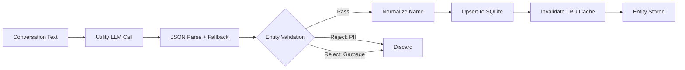
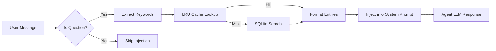

<div align="center">

# ⛓️ Mnemograph

### The In-Process Knowledge Graph for AI Agents

**No external databases. No network calls. No infrastructure.**

Mnemograph gives your AI agent a persistent memory layer that thinks in connections — entities, relationships, and contextual recall — running entirely inside the agent process.

[Features](#-why-mnemograph) · [Architecture](#-how-it-works) · [Install](#-installation) · [Config](#-configuration)

</div>

---

## 🧠 Why Mnemograph?

Every conversational AI agent forgets. Traditional solutions bolt on external databases — **Neo4j**, **Redis**, **PostgreSQL** — adding latency, infrastructure overhead, and failure modes.

**Mnemograph runs entirely inside your agent process.** SQLite for storage. asyncio for concurrency. The agent's own LLM for entity extraction. Zero external dependencies.

### The Problem with External Graph Databases

```
┌──────────────────────────────────────────────────────────────┐
│              TRADITIONAL EXTERNAL GRAPH SETUP                │
│                                                              │
│  Agent Process                External Infrastructure        │
│  ┌────────────┐               ┌──────────────┐               │
│  │   Agent    │──── HTTP ───▶ │   Neo4j /    │               │
│  │            │◀── /TCP ──────│   Redis /    │               │
│  │            │               │   Postgres   │               │
│  └────────────┘               └──────┬───────┘               │
│                                      │                       │
│                                      ▼                       │
│                               ┌──────────────┐               │
│                               │ Docker / VM  │               │
│                               │ Network Ops  │               │
│                               │ Backups      │               │
│                               │ Memory (RAM) │               │
│                               │ Version Pins │               │
│                               └──────────────┘               │
└──────────────────────────────────────────────────────────────┘

         Latency: 5-50ms per query    Overhead: 500MB-2GB RAM
         Dependencies: 3-15 packages      Failure modes: infinite
```

### The Mnemograph Way

```
┌──────────────────────────────────────────────────────────────┐
│                  MNEMOGRAPH — IN-PROCESS                      │
│                                                              │
│  Agent Process (Everything Inside)                           │
│  ┌────────────────────────────────────────────────────────┐  │
│  │   Agent    ──▶ Mnemograph Plugin                        │  │
│  │              ┌─────────────────────────────────┐       │  │
│  │              │  LRU Cache (2000 entries)       │       │  │
│  │              │  ┌────────────────────────────┐ │       │  │
│  │              │  │ SQLite (WAL mode)          │ │       │  │
│  │              │  │ * graph.db (~500KB)       │ │       │  │
│  │              │  │ * Thread-local conns       │ │       │  │
│  │              │  │ * Zero network I/O         │ │       │  │
│  │              │  └────────────────────────────┘ │       │  │
│  │              └─────────────────────────────────┘       │  │
│  └────────────────────────────────────────────────────────┘  │
│                                                              │
│         Latency: <1ms per query    Overhead: <2MB RAM        │
│         Dependencies: 0            Failure modes: 0           │
└──────────────────────────────────────────────────────────────┘
```

---

## 📊 Head-to-Head Comparison

| Capability | Mnemograph | Neo4j | Redis Graph | External Postgres |
|---|:---:|:---:|:---:|:---:|
| **External dependencies** | None | JVM + Docker | Redis Server | Postgres Server |
| **Network latency** | 0ms (in-process) | 5-50ms | 2-20ms | 5-100ms |
| **RAM overhead** | <2MB | 500MB-2GB | 256MB-1GB | 256MB-1GB |
| **Disk footprint** | ~500KB | 1-5GB | 100MB+ | 100MB+ |
| **Setup time** | Drop-in plugin | 30+ min | 20+ min | 30+ min |
| **Backup complexity** | Copy one file | Full dump pipeline | RDB + AOF | pg_dump + WAL |
| **Crash recovery** | SQLite WAL auto-recover | Manual restart | Manual replay | Manual recovery |
| **Infrastructure to manage** | Zero | Container/VM | Container/VM | Container/VM |
| **Works offline** | Yes | No (needs server) | No | No |

---

## 🧩 How It Works

Mnemograph operates in three phases during every agent conversation turn — all async, all bounded, all non-blocking.

### Conversation Loop Integration

```
┌───────────────────────────────────────────────────────────────┐
│                    AGENT CONVERSATION LOOP                     │
│                                                               │
│  (1) USER MESSAGE ARRIVES                                     │
│     │                                                         │
│     ▼                                                         │
│  ┌──────────────────────────────────────────────────────────┐ │
│  │  (2) RECALL HOOK                    Budget: 50ms         │ │
│  │  Extract keywords from user msg                           │ │
│  │  -> LRU Cache (2000 slots) -> SQLite DB (fallback)        │ │
│  │  -> Enrich loop_data extras with graph context            │ │
│  └──────────────────────────────────────────────────────────┘ │
│     │                                                         │
│     ▼                                                         │
│  ┌──────────────────────────────────────────────────────────┐ │
│  │  (3) SYSTEM PROMPT INJECTION       Budget: 10ms          │ │
│  │  Regex question detection -> Entity lookup (max 3)        │ │
│  │  -> Append context block to system_prompt                 │ │
│  └──────────────────────────────────────────────────────────┘ │
│     │                                                         │
│     ▼                                                         │
│  ┌──────────────────────────────────────────────────────────┐ │
│  │  (4) LLM RESPONSE (Monologue)                             │ │
│  └──────────────────────────────────────────────────────────┘ │
│     │                                                         │
│     ▼                                                         │
│  ┌──────────────────────────────────────────────────────────┐ │
│  │  (5) EXTRACTION HOOK               Async Background      │ │
│  │  Bounded Queue (50) -> Dedicated Worker                   │ │
│  │  * Circuit Breaker (3 fails -> 5min cooldown)             │ │
│  │  * Extract entities + relationships via utility LLM       │ │
│  │  * Validate (PII check, proper noun, length)              │ │
│  │  * Store to SQLite (WAL, thread-safe)                     │ │
│  │  * Invalidate LRU cache                                   │ │
│  └──────────────────────────────────────────────────────────┘ │
└───────────────────────────────────────────────────────────────┘
```

### Entity Extraction Pipeline



### Recall and Context Injection



---

## ⏱️ Performance Budgets

Mnemograph is engineered with **hard latency budgets** to ensure zero impact on agent responsiveness.

| Operation | Budget | Typical | Method |
|-----------|--------|---------|--------|
| **Recall** (entity lookup) | 50ms | 2-5ms | LRU cache + asyncio timeout |
| **Context injection** (per entity) | 10ms | 1-3ms | Regex match + cache lookup |
| **Extraction** (entity mining) | Background | 1-3s | Bounded queue + dedicated worker |
| **Health check** (cleanup) | On-demand | <100ms | Orphan delete + VACUUM |

### Latency Comparison

```
Query latency (ms, lower is better)

Mnemograph  ##                                              <2ms (in-process)
Redis Graph ######                                          2-20ms (TCP)
Postgres    ##########                                      5-100ms (TCP)
Neo4j       ########                                        5-50ms (HTTP/Bolt)
            |         |         |         |         |
            0ms       20ms       40ms       60ms      100ms
```

### Memory Overhead Comparison

```
RAM usage (MB, lower is better)

Mnemograph  #                                               <2MB (cache+conn)
Redis Graph ############                                    256MB (server)
Postgres    ############                                    256MB (server)
Neo4j       ###################                             500MB-2GB (JVM)
            |         |         |         |         |
            0MB       250MB      500MB     750MB     1GB+
```

---

## 🛡️ Safety Features

Mnemograph is engineered to **never break your agent**. Multiple protection layers ensure graceful degradation under any failure condition.

| Feature | What It Does | How It Protects |
|---------|-------------|----------------|
| **Circuit Breaker** | Trips after 3 consecutive extraction failures | Stops calling the LLM for 5 minutes, preventing cascading failures |
| **Bounded Queue** | Max 50 pending extractions | Prevents memory growth — drops oldest if full |
| **Hard Timeout Budgets** | 50ms recall, 10ms injection | Zero latency impact on user experience |
| **PII Detection** | Regex patterns for emails, API keys, tokens | Prevents secrets from entering the persistent graph |
| **Entity Validation** | Proper noun heuristic + forbidden patterns | Keeps filenames, URLs, and code snippets out |
| **Graceful Degradation** | Extraction disabled if utility model unavailable | Recall + injection continue using existing data |
| **Auto-Cleanup** | Health check removes orphans + VACUUM | Self-maintaining — no manual intervention |
| **SQLite WAL Mode** | Write-Ahead Logging + busy_timeout | Thread-safe writes, crash recovery |

---

## 📦 Production Stats

Production-proven in a live single-agent deployment:

| Metric | Value |
|--------|-------|
| **Entities tracked** | 861 |
| **Relationships mapped** | 1,505 |
| **Active domains** | 5 (work, platform, research, general, personal) |
| **Entity types** | 10 (technology, concept, tool, project, org, person, framework, language, location, skill) |
| **DB size on disk** | ~500KB |
| **RAM overhead** | <2MB (cache + connection) |
| **Query latency** | 2-5ms cached, <50ms uncached |
| **Orphaned relationships** | 0 (auto-cleanup maintains integrity) |

### Entity Distribution by Domain

```
Work      ========================================  347
Platform  ==============================            267
General   ==============                             120
Research  ==============                             116
Personal  ==                                            11

0        100       200       300       400
```

### Entity Distribution by Type

```
Technology  ============================  280
Concept     ==============                141
Tool        =============                 134
Project     ==========                    106
Organization=========                     94
Person     =====                          53
Framework  ===                            30
Language   =                              11
Location   =                              11
Skill                                      1

0        50        100       150       200
```

---

## 📥 Installation

### Requirements

- Python 3.12+
- SQLite3 (Python stdlib)
- asyncio (Python stdlib)
- Agent Zero framework (or compatible agent with `call_utility_model()` support)

**No pip packages required. No external services required.**

### Steps

1. **Copy the plugin** into your agent's plugin directory:

```bash
cp -r _graph_memory/ /your/agent/plugins/
```

2. **Initialize data directory**:

```bash
mkdir -p /your/agent/plugins/_graph_memory/data
```

3. **Clean any cached bytecode**:

```bash
find /your/agent/plugins/_graph_memory/ -type d -name '__pycache__' -exec rm -rf {} +
```

4. **Restart your agent**. The plugin auto-loads via `always_enabled: true` in `plugin.yaml`.

5. **Verify installation**:

```
# In agent chat:
graph_memory tool with action: stats
```

Expected: 0 entities, 0 relationships, schema version 1.

---

## ⚙️ Configuration

All settings live in `default_config.yaml`. Override by editing this file.

### Key Settings

| Parameter | Default | Purpose |
|-----------|---------|---------|
| `rollout_phase` | `full` | `shadow` = log only, `read_only` = recall only, `full` = inject context |
| `extraction_enabled` | `true` | Enable/disable entity extraction |
| `extraction_max_entities` | 10 | Max entities extracted per conversation turn |
| `extraction_max_relationships` | 15 | Max relationships per turn |
| `extraction_queue_maxsize` | 50 | Bounded queue size |
| `extraction_circuit_breaker_threshold` | 3 | Failures before circuit breaker opens |
| `recall_enabled` | `true` | Enable/disable recall enrichment |
| `recall_max_entities` | 3 | Max entities injected per recall |
| `recall_timeout_ms` | 50 | Hard budget for recall query |
| `context_inject_enabled` | `true` | Enable/disable system prompt injection |
| `context_inject_max_entities` | 3 | Max entities in context block |
| `validation_min_confidence` | 0.3 | Minimum LLM confidence for storage |
| `write_semaphore_limit` | 2 | Concurrent SQLite write limit |
| `sqlite_busy_timeout` | 5000 | SQLite busy timeout (ms) |

### Rollout Phases

| Phase | Extraction | Recall | Context Injection | Use Case |
|-------|-----------|--------|-------------------|----------|
| `shadow` | Runs (logged) | Runs (logged) | Disabled | Initial deployment testing |
| `read_only` | Disabled | Active | Disabled | Verify recall quality |
| `full` | Active | Active | Active | Full production |

---

## 🔧 API Reference

The user-facing `graph_memory` tool provides 7 actions:

| Action | Description | Required Args |
|--------|-------------|---------------|
| `search` | Search entities by name/description | `query` |
| `insights` | Get entities + relationships for a topic | `query` |
| `relationships` | Get all relationships for an entity | `entity_name` |
| `stats` | Graph statistics | — |
| `export` | Export graph to JSONL backup | `export_dir` (optional) |
| `import` | Import graph from JSONL | `import_path` |
| `health` | Run health check (auto-cleans orphans) | — |

### Example Usage

```python
# Search for entities
graph_memory(action="search", query="Docker")

# Get insights with relationships
graph_memory(action="insights", query="AI infrastructure", limit=5)

# Export full backup
graph_memory(action="export", export_dir="/backups/")

# Health check with auto-cleanup
graph_memory(action="health")
```

---

## 📁 File Structure

```
_graph_memory/
├── plugin.yaml                    # Plugin manifest (always_enabled: true)
├── default_config.yaml            # All configuration knobs
├── graph_migrations/
│   └── 001_initial.py            # SQLite schema definition
├── helpers/
│   ├── __init__.py
│   ├── graph_db.py               # SQLite operations (CRUD, migrations, WAL)
│   ├── entity_registry.py        # Entity CRUD + LRU cache (async wrappers)
│   ├── graph_extractor.py        # LLM-based entity extraction
│   ├── graph_lifecycle.py        # Export/import, health check, cleanup
│   ├── graph_bridge.py           # Cross-plugin read-only API
│   └── entity_validator.py       # PII detection + entity validation
├── tools/
│   ├── graph_memory.py           # User-facing tool (search/stats/export/health)
│   └── graph_backfill.py         # Batch ingestion from chat history
├── extensions/python/
│   ├── startup_migration/
│   │   └── _01_graph_schema_init.py   # Auto-create tables on boot
│   ├── system_prompt/
│   │   └── _30_graph_context.py       # Context injection into prompts
│   ├── monologue_end/
│   │   └── _55_graph_extract.py       # Entity extraction (background)
│   └── message_loop_prompts_after/
│       └── _48_graph_recall.py        # Recall enrichment
├── prompts/
│   └── agent.system.tool.graph_memory.md  # Tool prompt
└── data/                          # Auto-created on first run
    └── graph.db                   # SQLite database (~500KB)
```

---

## 🔒 Entity and Relationship Schemas

### Entity Schema

| Column | Type | Description |
|--------|------|-------------|
| `entity_id` | TEXT PK | UUID hex (16-char) |
| `name` | TEXT UNIQUE | Normalized entity name |
| `type` | TEXT | person, organization, technology, concept, project, skill, location, tool, framework, language |
| `domain` | TEXT | work, personal, platform, research, general |
| `confidence` | REAL | 0.1-1.0 (decays over time) |
| `mention_count` | INTEGER | Incremented on re-extraction |
| `description` | TEXT | LLM-provided description |
| `aliases` | TEXT | JSON array of alternate names |
| `first_seen` | TEXT | ISO timestamp |
| `last_seen` | TEXT | ISO timestamp |
| `session_id` | TEXT | Chat session where discovered |

### Relationship Schema

| Column | Type | Description |
|--------|------|-------------|
| `id` | INTEGER PK | Auto-increment |
| `source_name` | TEXT | Source entity name |
| `target_name` | TEXT | Target entity name |
| `rel_type` | TEXT | uses, depends_on, runs_on, related_to, part_of, owns, built_with, alternative_to, predecessor_of, competes_with |
| `confidence` | REAL | 0.1-1.0 |
| `source_doc` | TEXT | Session ID where discovered |
| `created_at` | TEXT | ISO timestamp |

---

## 📤 Backup and Export

### Export

```python
graph_memory(action="export")
# Writes JSONL with SHA-256 checksum to /a0/shared/backup/
```

### Import

```python
graph_memory(action="import", import_path="/path/to/snapshot.jsonl")
# Verifies checksum, merges or replaces, transactional
```

### Manual Backup

Since Mnemograph uses a single SQLite file, backup is trivial:

```bash
cp data/graph.db data/graph.db.backup_$(date +%Y%m%d)
```

---

## 🔄 Batch Backfill

Populate the graph from existing chat history or knowledge base files:

```bash
python3 tools/graph_backfill.py --source knowledge_base --path /your/kb/
python3 tools/graph_backfill.py --source recent_conversations --path /your/chats/ --days 30
```

Features:
- Token-aware chunking with overlap
- Three-layer deduplication (exact, fuzzy, semantic)
- GPU-aware adaptive rate limiting
- Circuit breaker protection
- Checkpoint-based resume

---

## 🧪 Built With

- **Python 3.12+** — No external packages
- **SQLite3** — Python standard library
- **asyncio** — Async I/O concurrency
- **Agent Zero Framework** — Extension hooks and utility model integration

---

## 📄 License

MIT License — see [LICENSE](LICENSE).

---

<div align="center">

**Mnemograph** — *The memory layer that thinks in connections.*

</div>
